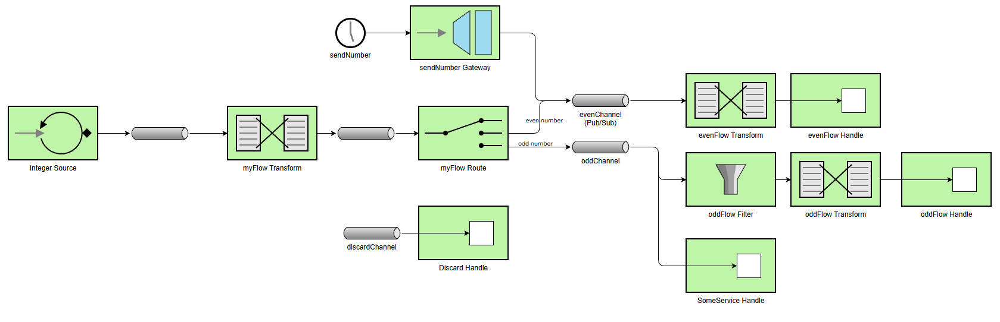

# Lab 5 Integration and SOA - Project Report

## 1. EIP Diagram (Before)



### Initial Architecture Overview

The starter code demonstrates several message flows and makes use of common Enterprise Integration Patterns (EIPs), but it contains **multiple issues** that affect correct message processing.

The _integer source_ functions as a polling producer, emitting sequential integers starting from zero at intervals of 100 milliseconds. Each generated number is routed immediately based on its parity, with even numbers directed to the _even channel_ and odd numbers to the _odd channel_. In addition to this sequence, a _scheduled gateway_ injects random negative numbers into the system every second. However, these numbers are always sent directly to the _even channel_, regardless of whether they are actually even or odd, which violates the intended routing logic.

For processing, even numbers are routed to a **publish-subscribe channel**, although currently **only a single subscriber** exists. They pass through a _transformer_ that converts the integer into a string representation such as "Number n" and are then handled by the designated even handler. Odd numbers follow a different path, flowing through a **direct channel** that is **shared between the odd handler and a service activator** defined in the SomeService component. Because the channel is direct, each odd number is delivered to **only one of these consumers**, meaning that some odd numbers are processed by the handler while others are consumed by the service, leading to inconsistent behavior.

The odd flow contains a _filter_ intended to check message validity, but it is misconfigured. The filter rejects odd numbers, and the discard channel that should capture these rejected messages is currently commented out, causing some messages to be lost entirely. In fact, the application defines a _discard channel_ and an associated _flow_ for handling messages that are filtered out, but this infrastructure remains unused in the current implementation.

The improper configuration of channels, filters, and the gateway results in message loss, incorrect routing, and inconsistent processing outcomes.

---

## 2. What Was Wrong

### Bug 1: Fragmented message ingress architecture

**Problem**: The `myFlow` bean embedded routing logic directly within the polling source flow, while the `SendNumber` gateway was configured to inject messages directly into `evenChannel`. This created two separate architectural paths where polled numbers followed one route and gateway-injected numbers bypassed the router entirely, violating the single point of entry.

The original implementation combined message generation with routing decisions:

```kotlin
@Bean
fun myFlow(integerSource: AtomicInteger): IntegrationFlow =
    integrationFlow(
        source = { integerSource.getAndIncrement() },
        options = { poller(Pollers.fixedRate(100)) },
    ) {
        transform { num: Int -> /* ... */ }
        route { p: Int ->
            val channel = if (p % 2 == 0) "evenChannel" else "oddChannel"
            logger.info("🔀 Router: {} → {}", p, channel)
            channel
        }
    }
```

**EIP Pattern Involved**: message source and content-based router

**Impact**: Odd negative numbers (such as -77, -45, -39) injected through the gateway were incorrectly routed to `evenChannel` and processed as even numbers. The system produced inconsistent behavior where identical routing logic yielded different outcomes depending on whether messages originated from the polling source or the gateway. This architectural fragmentation made it impossible to maintain uniform business rules across all message entry points.

**Solution**: Introduced `numberChannel` as a unified ingress point for all messages, regardless of origin. The solution involved two architectural changes:

1. Refactored `myFlow` to terminate at `numberChannel` instead of performing routing internally:

```kotlin
@Bean
fun myFlow(integerSource: AtomicInteger): IntegrationFlow =
    integrationFlow(
        source = { integerSource.getAndIncrement() },
        options = { poller(Pollers.fixedRate(100)) },
    ) {
        transform { num: Int -> /* ... */ }
        channel("numberChannel")
    }
```

2. Created a dedicated routing flow that subscribes to the unified channel:

```kotlin
@Bean
fun numberFlow(): IntegrationFlow =
    integrationFlow("numberChannel") {
        route { p: Int ->
            val channel = if (p % 2 == 0) "evenChannel" else "oddChannel"
            logger.info("🔀 Router: {} → {}", p, channel)
            channel
        }
    }
```

3. Updated the gateway to send to the unified ingress channel:

```kotlin
@MessagingGateway
interface SendNumber {
    @Gateway(requestChannel = "numberChannel")
    fun sendNumber(number: Int)
}
```

This enforces the Content-Based Router as the single decision-making authority for all messages, ensuring consistent application of routing rules regardless of message origin.

---

### Bug 2: Inverted filter logic in odd flow

**Problem**: The odd flow contained a filter configured with the condition `p % 2 == 0`, which accepts even numbers rather than odd numbers. Since the Content-Based Router guarantees that only odd numbers reach `oddChannel`, this filter rejected every legitimate message it encountered. The filter's purpose was inverted—it accepted exactly the messages that should never arrive at this channel.

The problematic filter implementation:

```kotlin
@Bean
fun oddFlow(): IntegrationFlow =
    integrationFlow("oddChannel") {
        filter { p: Int ->
            val passes = p % 2 == 0
            logger.info("  🔍 Odd Filter: checking {} → {}", p, if (passes) "PASS" else "REJECT")
            passes
        }
        // ... rest of flow
    }
```

**EIP Pattern Involved**: message filter pattern

**Impact**: When odd numbers reached this filter through the odd direct channel's round-robin distribution, they were discarded. Messages that happened to be load-balanced to the service activator bypassed the filter entirely and were processed successfully. This created non-deterministic processing where some odd numbers (3, 7, 11, 15...) were handled correctly while others (1, 5, 9, 13...) vanished.

**Solution**: Corrected the filter condition to `p % 2 != 0` to properly accept odd numbers:

```kotlin
filter { p: Int ->
    val passes = p % 2 != 0
    logger.info("  🔍 Odd Filter: checking {} → {}", p, if (passes) "PASS" else "REJECT")
    passes
}
```

**Pattern Consideration**: While the corrected filter now functions properly, it remains technically **redundant** since the router already guarantees message validity. However, retaining the filter provides an additional layer of defense-in-depth, ensuring that even if future changes introduce unexpected messages into `oddChannel`, they will be caught and rejected. This explicit validation clarifies the channel's contract and enhances system robustness.

---

### Bug 3: Direct channel instead of publish-subscribe for odd processing

**Problem**: The `oddChannel` was implicitly created as a direct channel (Spring Integration's default behavior when no explicit channel bean is defined). Direct channels implement point-to-point semantics with round-robin load balancing among subscribers. With two consumers registered—the `oddFlow` handler and the `SomeService` service activator, each message was delivered to exactly one subscriber, alternating between them. This violated the architectural requirement that all odd numbers be processed by both consumers concurrently.

**EIP Pattern Involved**: Publish-subscribe channel vs. point-to-point channel

**Impact**: Odd numbers exhibited inconsistent processing patterns. Messages routed to the service activator (numbers 3, 7, 11, 15, 19...) were logged successfully and processed completely. However, messages routed to the filter-based handler (numbers 1, 5, 9, 13, 17...) encountered the inverted filter logic and were rejected. This behavior directly contradicted the target architecture diagram, which specified that both handlers must process every odd message.

**Solution**: Explicitly defined `oddChannel` as a Publish-Subscribe Channel to ensure broadcast semantics:

```kotlin
@Bean
fun oddChannel(): PublishSubscribeChannelSpec<*> = MessageChannels.publishSubscribe()
```

With this configuration, each odd number is simultaneously delivered to all registered subscribers. Both the transformation-filter-handler pipeline and the service activator now receive and process every odd message concurrently, ensuring complete and consistent processing as specified in the target architecture.

On the other hand, evenChannel was explicitly defined as a direct channel to maintain point-to-point semantics. A publish-subscribe channel was not necessary for even numbers since only one handler existed. This distinction highlights the importance of channel semantics in achieving the desired message delivery guarantees.

---

### Bug 4: Tightly coupled routing in source flow

**Problem**: The `myFlow` bean violated the Single Responsibility Principle by combining two distinct concerns: message generation through polling and routing logic based on parity. This tight coupling prevented the router from being reusable by other message sources. When the gateway needed to inject messages, it had no way to leverage the existing routing logic and was forced to make routing decisions independently (incorrectly choosing `evenChannel`).

**EIP Pattern Involved**: separation of concerns and message endpoint

**Impact**: The architecture could not support multiple message origins converging on unified processing rules. Each new message source would require duplicating the routing logic, creating maintenance burden and increasing the risk of inconsistent routing decisions. The tight coupling made the system rigid and difficult to extend.

**Solution**: Applied the separation of concerns principle by decomposing the flow into two specialized beans:

1. **Message Source**: `myFlow` now focuses exclusively on polling and publishing to the unified ingress:

```kotlin
@Bean
fun myFlow(integerSource: AtomicInteger): IntegrationFlow =
    integrationFlow(
        source = { integerSource.getAndIncrement() },
        options = { poller(Pollers.fixedRate(100)) },
    ) {
        transform { num: Int -> /* ... */ }
        channel("numberChannel")
    }
```

2. **Content-Based Router**: `numberFlow` implements routing logic in isolation:

```kotlin
@Bean
fun numberFlow(): IntegrationFlow =
    integrationFlow("numberChannel") {
        route { p: Int ->
            val channel = if (p % 2 == 0) "evenChannel" else "oddChannel"
            logger.info("🔀 Router: {} → {}", p, channel)
            channel
        }
    }
```

This separation makes the router independently reusable by any message source—polling producers, gateways, or future integration points, ensuring consistent routing behavior throughout the system.

---

### Bug 5: Orphaned discard channel infrastructure

**Problem**: The application defined both a `discardChannel` and a corresponding `discarded()` integration flow to handle rejected messages. However, the filter's `discardChannel` configuration parameter was commented out, meaning rejected messages had no destination specified. This created orphaned infrastructure with components that were never invoked.

The unused discard flow:

```kotlin
@Bean
fun discarded(): IntegrationFlow =
    integrationFlow("discardChannel") {
        handle { p ->
            logger.info("  🗑️  Discard Handler: [{}]", p.payload)
        }
    }
```

And the filter without discard routing:

```kotlin
filter { p: Int ->
    val passes = p % 2 == 0
    passes
} // , { discardChannel("discardChannel") })
```

**EIP Pattern Involved**: Invalid message channel (Dead Letter Channel)

**Impact**: Rejected messages disappeared silently without any logging, monitoring, or handling. This broke observability completely, there was no audit trail for failed messages. In production environments, this would violate compliance requirements for message tracking and create blind spots in system monitoring.

**Solution**: Removed the unused `discarded()` bean and channel definition entirely to simplify the architecture and eliminate dead code. Since the corrected **filter now accepts all legitimate odd numbers** and the router ensures proper message typing, no discard mechanism is necessary in the corrected implementation.

**Alternative production approach**: In enterprise systems requiring comprehensive audit trails, the proper solution would be to uncomment the `discardChannel` configuration and implement robust rejected message handling with persistence, alerting, and manual intervention capabilities. This would align with the Dead Letter Channel pattern for production-grade error recovery.

---

## 3. Bonus Features Implemented

### Splitter and Aggregator Pattern

The Splitter and Aggregator pattern enables the system to decompose composite messages into individual elements for parallel processing, then consolidate results into a unified response. This implementation demonstrates how batch operations can be optimized through **concurrent execution** while maintaining data consistency.

The architecture begins with a `SendBatch` gateway that accepts lists of integers and routes them to `batchSplitterFlow`. This flow enriches incoming batches with metadata including `batchSource`, `batchReceivedAt`, and `batchSize` before splitting each list into individual messages using **Spring Integration's splitter component**. Each split message automatically receives correlation headers (`correlationId`, `sequenceNumber`, `sequenceSize`) that enable downstream aggregation. The split messages are further enriched with `splitFrom` header to track their origin.

Individual messages flow into `processSplitNumbersFlow`, where they are processed in parallel using **virtual threads** created by `Executors.newVirtualThreadPerTaskExecutor()`. Each number is squared with a simulated 100ms processing delay to demonstrate concurrent execution benefits. The parallel processing significantly reduces total processing time compared to sequential execution, a batch of 5 numbers completes in approximately 115ms rather than 500ms.

After processing, the `aggregatorFlow` collects results using a correlation strategy based on the `correlationId` header. The aggregator waits until all messages in the sequence arrive (verified by comparing `sequenceNumber` against `sequenceSize`), then computes statistics including count, sum, and average of squared values. The consolidated result is delivered to a final handler that logs the complete aggregation.

Log verification demonstrates the pattern's effectiveness. When a batch `[96, 87, 10, 67, 98]` enters the system, we observe:

```
12:20:10.569 [scheduling-1] INFO  soa.CronOddEvenDemo - Batch Gateway: Sending batch of 5 numbers: [96, 87, 10, 67, 98]
12:20:10.569 [scheduling-1] INFO  soa.CronOddEvenDemo - Wire Tap: Monitoring message. Payload: [96, 87, 10, 67, 98] (Type: ArrayList)
12:20:10.569 [scheduling-1] INFO  soa.CronOddEvenDemo - Wire Tap: Enriched Headers: {batchSource=BatchGateway, batchReceivedAt=1763724010569, batchSize=5}
12:20:10.572 [scheduling-1] INFO  soa.CronOddEvenDemo - Splitter: Split out number 96
12:20:10.572 [scheduling-1] INFO  soa.CronOddEvenDemo - Wire Tap: Monitoring message. Payload: 96 (Type: Integer)
12:20:10.572 [scheduling-1] INFO  soa.CronOddEvenDemo - Wire Tap: Enriched Headers: {batchSource=BatchGateway, sequenceNumber=1, batchReceivedAt=1763724010569, sequenceSize=5, splitFrom=BatchSplitter, correlationId=0340275f-f738-7f2d-badf-bb462a24a00c, batchSize=5}
12:20:10.576 [scheduling-1] INFO  soa.CronOddEvenDemo - Splitter: Split out number 87
12:20:10.576 [scheduling-1] INFO  soa.CronOddEvenDemo - Wire Tap: Monitoring message. Payload: 87 (Type: Integer)
12:20:10.576 [scheduling-1] INFO  soa.CronOddEvenDemo - Wire Tap: Enriched Headers: {batchSource=BatchGateway, sequenceNumber=2, batchReceivedAt=1763724010569, sequenceSize=5, splitFrom=BatchSplitter, correlationId=0340275f-f738-7f2d-badf-bb462a24a00c, batchSize=5}
12:20:10.576 [scheduling-1] INFO  soa.CronOddEvenDemo - Splitter: Split out number 10
12:20:10.576 [scheduling-1] INFO  soa.CronOddEvenDemo - Wire Tap: Monitoring message. Payload: 10 (Type: Integer)
12:20:10.576 [scheduling-1] INFO  soa.CronOddEvenDemo - Wire Tap: Enriched Headers: {batchSource=BatchGateway, sequenceNumber=3, batchReceivedAt=1763724010569, sequenceSize=5, splitFrom=BatchSplitter, correlationId=0340275f-f738-7f2d-badf-bb462a24a00c, batchSize=5}
12:20:10.577 [scheduling-1] INFO  soa.CronOddEvenDemo - Splitter: Split out number 67
12:20:10.577 [scheduling-1] INFO  soa.CronOddEvenDemo - Wire Tap: Monitoring message. Payload: 67 (Type: Integer)
12:20:10.577 [scheduling-1] INFO  soa.CronOddEvenDemo - Wire Tap: Enriched Headers: {batchSource=BatchGateway, sequenceNumber=4, batchReceivedAt=1763724010569, sequenceSize=5, splitFrom=BatchSplitter, correlationId=0340275f-f738-7f2d-badf-bb462a24a00c, batchSize=5}
12:20:10.577 [scheduling-1] INFO  soa.CronOddEvenDemo - Splitter: Split out number 98
12:20:10.577 [scheduling-1] INFO  soa.CronOddEvenDemo - Wire Tap: Monitoring message. Payload: 98 (Type: Integer)
12:20:10.577 [scheduling-1] INFO  soa.CronOddEvenDemo - Wire Tap: Enriched Headers: {batchSource=BatchGateway, sequenceNumber=5, batchReceivedAt=1763724010569, sequenceSize=5, splitFrom=BatchSplitter, correlationId=0340275f-f738-7f2d-badf-bb462a24a00c, batchSize=5}
12:20:10.693 [virtual-49] INFO  soa.CronOddEvenDemo - Processor: 96 squared = 9216 [Time: 114ms]
12:20:10.693 [virtual-51] INFO  soa.CronOddEvenDemo - Processor: 87 squared = 7569 [Time: 114ms]
12:20:10.693 [virtual-54] INFO  soa.CronOddEvenDemo - Processor: 10 squared = 100 [Time: 114ms]
12:20:10.693 [virtual-56] INFO  soa.CronOddEvenDemo - Processor: 98 squared = 9604 [Time: 114ms]
12:20:10.693 [virtual-55] INFO  soa.CronOddEvenDemo - Processor: 67 squared = 4489 [Time: 114ms]
12:20:10.698 [virtual-54] INFO  soa.CronOddEvenDemo - Aggregator: Collected 5 squared values, sum=30978, avg=6195
12:20:10.702 [virtual-54] INFO  soa.CronOddEvenDemo - Batch Result Handler: Final aggregated result = {count=5, values=[4489, 7569, 9604, 9216, 100], sum=30978, average=6195}
```

virtual-49, virtual-51, virtual-54, virtual-55, and virtual-56 threads process split messages concurrently, completing in approximately 114ms each. The aggregator then consolidates results efficiently.

The pattern provides critical benefits for enterprise integration: it enables horizontal scaling through **parallel processing**, maintains message correlation across distributed operations, and ensures result completeness through aggregation tracking. The virtual thread implementation further optimizes resource utilization by avoiding traditional thread pool exhaustion during high-volume batch processing.

---

### Dead Letter Channel Pattern

The Dead Letter Channel pattern implements enterprise-grade error handling by routing failed messages to a dedicated channel **after exhausting retry attempts**. This ensures that transient failures are recovered automatically while permanent failures are isolated for investigation without blocking message flow.

The implementation centers on `riskyIngressFlow`, which processes potentially problematic numbers through the `RiskyNumberHandler` component. This handler simulates real-world error conditions by rejecting three specific values: zero, thirteen, and 666. The retry mechanism is configured through the `retryAdvice()` bean, which implements exponential backoff with parameters: 400ms initial interval, 1.5x multiplier, 5000ms maximum interval, and 3 maximum attempts (1 initial + 2 retries).

When a message fails processing, Spring Integration's retry advice automatically attempts redelivery with increasing delays. If all retry attempts are exhausted, the recovery callback enriches the message with error metadata (`error`, `exceptionType`, `errorTimestamp`, `failedMessage`) and routes it to the `deadLetterChannel`. This `deadLetterChannel` is a queue channel that persists failed messages. The `deadLetterFlow` consumes these messages and logs comprehensive error information including the original payload and failure reason.

The pattern's architecture leverages several Spring Integration mechanisms: `@Lazy` injection breaks circular dependencies between the Dead Letter Channel and the application context, `@Qualifier("deadLetterChannel")` ensures precise bean selection avoiding ambiguity with built-in channels like `errorChannel`, and `QueueChannel` provides buffering capacity to handle bursts of failures without loss.

Log output demonstrates the retry behavior and final DLQ routing:

```
12:20:12.562 [scheduling-1] INFO  soa.CronOddEvenDemo - Risky Gateway: Sending number 13 for processing
12:20:12.565 [scheduling-1] INFO  soa.CronOddEvenDemo - Handler: Processing number 13
12:20:12.565 [scheduling-1] ERROR soa.CronOddEvenDemo - ERROR Handler: Unlucky number 13
12:20:12.980 [scheduling-1] INFO  soa.CronOddEvenDemo - Handler: Processing number 13
12:20:12.980 [scheduling-1] ERROR soa.CronOddEvenDemo - ERROR Handler: Unlucky number 13
12:20:13.581 [scheduling-1] INFO  soa.CronOddEvenDemo - Handler: Processing number 13
12:20:13.581 [scheduling-1] ERROR soa.CronOddEvenDemo - ERROR Handler: Unlucky number 13
12:20:13.584 [scheduling-1] ERROR soa.CronOddEvenDemo - Retry exhausted for message: 13, sending to DLQ
12:20:13.585 [scheduling-1] ERROR soa.CronOddEvenDemo - DLQ: Received failed message - Payload: 13
12:20:13.585 [scheduling-1] ERROR soa.CronOddEvenDemo - Error: Failed to handle
12:20:13.585 [scheduling-1] ERROR soa.CronOddEvenDemo - All retries exhausted, message permanently failed
```

The timestamps reveal the exponential backoff progression: first retry after 415ms (12:20:12.980 - 12:20:12.565), second retry after 601ms (12:20:13.581 - 12:20:12.980), and final DLQ routing. This pattern provides audit trails for compliance requirements, and enables operational teams to analyze and resolve recurring error patterns through centralized dead letter monitoring.

---

### Wire Tap Pattern

The Wire Tap pattern enables non-intrusive monitoring of message flows by creating passive observation points that do not affect primary message processing. This implementation provides comprehensive visibility into message transformations and header enrichment throughout the integration pipeline.

The architecture establishes `tapChannel` as a direct channel with a dedicated subscriber (`wireTapFlow`) that logs message payloads and enriched headers. Wire taps are strategically placed at critical points using the `wireTap("tapChannel")` method: after message source generation in `myFlow`, after the router enriches routing metadata in `numberFlow`, after even/odd transformations in `evenFlow` and `oddFlow`, and before/after batch splitting in `batchSplitterFlow`. Each wire tap intercepts a copy of the message without modifying or delaying the original flow.

The `wireTapFlow` handler examines each intercepted message, extracting the payload type and content for logging. It filters out standard Spring Integration headers (id, timestamp, replyChannel, errorChannel) and displays only enriched headers added by the Content Enricher pattern. This selective logging reduces noise while highlighting valuable metadata such as `messageSource`, `routerName`, `parity`, `processingPath`, and timing information.

The pattern's power lies in its transparency: wire taps operate as read-only observers that cannot interfere with message delivery guarantees or processing logic. Log verification shows the wire tap capturing message evolution through processing stages:

```
12:20:14.593 [scheduling-1] INFO  soa.CronOddEvenDemo - Wire Tap: Monitoring message. Payload: 41 (Type: Integer)
12:20:14.593 [scheduling-1] INFO  soa.CronOddEvenDemo - Wire Tap: Enriched Headers: {messageSource=PollingSource, messageType=SequentialNumber}
12:20:14.593 [scheduling-1] INFO  soa.CronOddEvenDemo - Wire Tap: Monitoring message. Payload: 41 (Type: Integer)
12:20:14.593 [scheduling-1] INFO  soa.CronOddEvenDemo - Wire Tap: Enriched Headers: {messageSource=PollingSource, messageType=SequentialNumber, routerName=EvenOddRouter, routingTimestamp=1763724014593}
12:20:14.593 [scheduling-1] INFO  soa.CronOddEvenDemo - ? Router: 41 ? oddChannel
12:20:14.593 [scheduling-1] INFO  soa.CronOddEvenDemo -   ? Odd Filter: checking 41 ? PASS
12:20:14.594 [scheduling-1] INFO  soa.CronOddEvenDemo -   ??  Odd Transformer: 41 ? 'Number 41'
12:20:14.594 [scheduling-1] INFO  soa.CronOddEvenDemo - Wire Tap: Monitoring message. Payload: Number 41 (Type: String)
12:20:14.594 [scheduling-1] INFO  soa.CronOddEvenDemo - Wire Tap: Enriched Headers: {filterCompletedAt=1763724014594, transformationCompletedAt=1763724014594, messageType=SequentialNumber, processingPath=OddFlow, routerName=EvenOddRouter, parity=ODD, filterPassed=true, messageSource=PollingSource, processingStartTime=1763724014593, routingTimestamp=1763724014593}
```

Three wire tap observations capture the same message at different stages: first as an integer after source generation with origin metadata, second after routing with router metadata added, and third after transformation to string with complete processing metadata. This demonstrates how wire taps provide temporal visibility into message mutations without requiring instrumentation in business logic.

The pattern delivers significant operational benefits: it enables debugging complex flows by tracing individual messages, supports performance analysis through timestamp comparison and facilitates compliance monitoring without impacting throughput.

---

### Content Enricher Pattern

The Content Enricher pattern augments messages with additional metadata as they flow through the integration pipeline, enabling downstream components to make informed processing decisions and providing comprehensive audit trails. This implementation demonstrates systematic enrichment at every processing stage using Spring Integration's `enrichHeaders{}` DSL.

The enrichment strategy applies metadata hierarchically based on message lifecycle phases. Source-level enrichment occurs in `myFlow` immediately after message generation, adding `messageSource=PollingSource` and `messageType=SequentialNumber` to distinguish polled messages from gateway-injected ones. Router-level enrichment in `numberFlow` adds `routerName=EvenOddRouter` and `routingTimestamp`.

Processing path enrichment diverges based on message type. Even messages flowing through `evenFlow` receive `parity=EVEN`, `processingPath=EvenFlow`, `processingStartTime`, and `transformationCompletedAt` headers. Odd messages in `oddFlow` receive `parity=ODD`, `processingPath=OddFlow`, `processingStartTime`, `filterPassed=true`, `filterCompletedAt`, and `transformationCompletedAt`. This path-specific metadata enables precise tracking of which processing branch handled each message and how long each stage consumed.

Batch processing receives specialized enrichment in `batchSplitterFlow`, where incoming batches are tagged with `batchSource=BatchGateway`, `batchReceivedAt`, and `batchSize`. After splitting, individual messages inherit batch headers and gain `splitFrom=BatchSplitter`.

The implementation leverages three enrichment techniques: `headerExpression()` for dynamic values using SpEL (`"T(System).currentTimeMillis()"`), `header()` for static string constants (`"PollingSource"`), and `headerFunction()` for complex calculations requiring full message access. Duration calculations in handlers use enriched timestamps to compute processing time: `(transformationCompletedAt - processingStartTime)`.

Log evidence confirms enrichment propagation through the pipeline:

```
12:20:14.593 [scheduling-1] INFO  soa.CronOddEvenDemo - Wire Tap: Monitoring message. Payload: 41 (Type: Integer)
12:20:14.593 [scheduling-1] INFO  soa.CronOddEvenDemo - Wire Tap: Enriched Headers: {messageSource=PollingSource, messageType=SequentialNumber}
12:20:14.593 [scheduling-1] INFO  soa.CronOddEvenDemo - Wire Tap: Monitoring message. Payload: 41 (Type: Integer)
12:20:14.593 [scheduling-1] INFO  soa.CronOddEvenDemo - Wire Tap: Enriched Headers: {messageSource=PollingSource, messageType=SequentialNumber, routerName=EvenOddRouter, routingTimestamp=1763724014593}
12:20:14.593 [scheduling-1] INFO  soa.CronOddEvenDemo - ? Router: 41 ? oddChannel
12:20:14.593 [scheduling-1] INFO  soa.CronOddEvenDemo -   ? Odd Filter: checking 41 ? PASS
12:20:14.594 [scheduling-1] INFO  soa.CronOddEvenDemo -   ??  Odd Transformer: 41 ? 'Number 41'
12:20:14.594 [scheduling-1] INFO  soa.CronOddEvenDemo - Wire Tap: Monitoring message. Payload: Number 41 (Type: String)
12:20:14.594 [scheduling-1] INFO  soa.CronOddEvenDemo - Wire Tap: Enriched Headers: {filterCompletedAt=1763724014594, transformationCompletedAt=1763724014594, messageType=SequentialNumber, processingPath=OddFlow, routerName=EvenOddRouter, parity=ODD, filterPassed=true, messageSource=PollingSource, processingStartTime=1763724014593, routingTimestamp=1763724014593}
12:20:14.594 [scheduling-1] INFO  soa.CronOddEvenDemo -   ? Odd Handler: Processed [Number 41] (duration: 1ms)
12:20:14.594 [scheduling-1] INFO  soa.CronOddEvenDemo -   ? Service Activator: Received [41] (type: Integer)
```

The progression shows headers accumulating through three wire tap observations: initial source headers, router-added headers, and complete processing headers including filter and transformation metadata. The handler log confirms duration calculation using enriched timestamps (1ms).

The pattern provides substantial value for enterprise systems: enriched headers enable distributed tracing across microservices boundaries, facilitate root cause analysis by preserving processing path decisions, and enable dynamic routing based on accumulated metadata. Unlike invasive logging that couples business logic to monitoring concerns, Content Enricher maintains separation of concerns by treating metadata as first-class message properties that flow transparently through the integration architecture.

---

## 4. What You Learned

This lab provided comprehensive exposure to _Enterprise Integration Patterns_ and their practical implementation in message-driven architectures. Working through content-based routing, message transformation, channel semantics, filtering, and advanced patterns like Dead Letter Channel, Wire Tap, Splitter/Aggregator, and Content Enricher revealed how each pattern addresses specific integration challenges. The experience demonstrated that EIPs are not isolated solutions but interconnected components that collectively build resilient, observable, and scalable integration systems. Understanding how these patterns compose, such as combining Wire Tap for monitoring with Content Enricher for metadata propagation, illustrated the architectural thinking required to design production-grade message flows.

Spring Integration's declarative approach through Kotlin DSL became clear as the lab assignment progressed. The framework abstracts low-level messaging complexity behind intuitive constructs like `IntegrationFlow`, channel types (direct, publish-subscribe, queue), gateway interfaces, and advice chains. Configuring exponential backoff retry with `RequestHandlerRetryAdvice`, implementing non-intrusive monitoring through `wireTap()`, splitting and aggregating messages, and enriching messages with `enrichHeaders{}` showed how Spring Integration translates EIP theory into concrete and maintainable code.

The most challenging aspect was implementing the retry logic for the Dead Letter Channel pattern and ensuring it functioned correctly with exponential backoff. Configuring `ExponentialBackOffPolicy` with precise timing parameters, creating a recovery callback that properly enriched failed messages with error metadata, and routing exhausted retries to the queue channel required careful coordination of multiple Spring Integration components. The circular dependency between `deadLetterChannel` and the integration application context necessitated using `@Lazy` injection, while distinguishing it from built-in error channels required `@Qualifier` annotations. Verifying the retry behavior through log analysis—tracking timestamps to confirm exponential backoff progression (415ms, 601ms intervals) and validating DLQ message enrichment required iterative testing and deep understanding of Spring Integration's retry infrastructure.

Beyond the retry challenge, reconstructing the correct message flow architecture from broken starter code demanded systematic debugging. The logs revealed symptoms (odd numbers vanishing, negative numbers misrouted) that required tracing back through channel configurations, filter logic, and gateway bindings to identify root causes. Distinguishing between direct and publish-subscribe channel semantics, recognizing when Spring Integration's defaults caused unintended behavior, and applying explicit configuration to enforce architectural intent became critical debugging skills. The combination of log analysis, EIP pattern knowledge, and Spring Integration documentation enabled resolution of complex multi-pattern interaction issues that weren't immediately obvious from code inspection alone.

---

## 5. AI Disclosure

**AI tools used**: ChatGPT

**How AI assisted**:

ChatGPT was primarily used to troubleshoot specific technical challenges encountered during the bonus feature implementations, particularly when configuring the Dead Letter Channel pattern. The retry advice configuration with `ExponentialBackOffPolicy` presented complex issues around circular dependency resolution, the Dead Letter Channel needed to be injected into the integration context, but the context itself was still being constructed. ChatGPT helped clarify that `@Lazy` annotation could break this circular reference by deferring bean initialization, and that `@Qualifier("deadLetterChannel")` was necessary to disambiguate from Spring Integration's built-in `errorChannel` and `nullChannel`. Additionally, AI tools helped improve the structure and readability of this technical report, suggesting clearer ways to present complex EIP pattern explanations.

**Personal work**:

All core analytical and implementation work was performed independently. I analyzed the starter code by running the application and observing log output, which revealed the five architectural bugs: fragmented message ingress (gateway bypassing router), inverted filter logic rejecting valid odd numbers, implicit direct channel preventing publish-subscribe semantics, tightly coupled routing logic, and orphaned discard channel infrastructure. Each bug was identified by comparing actual behavior from logs against the expected architecture diagram, then traced back through code to determine root causes.

The architectural redesign, introducing `numberChannel` as unified ingress, separating routing from message generation, explicitly defining channel types, and correcting filter conditions, was designed based on my understanding of how Enterprise Integration Patterns should compose to create consistent message flows. I implemented all four bonus patterns (Splitter/Aggregator, Dead Letter Channel, Wire Tap, Content Enricher) by studying **Spring Integration documentation**, understanding how each pattern addresses specific integration requirements.

Testing and verification were entirely manual processes. I ran the application repeatedly, examined log timestamps to validate exponential backoff timing, verified that enriched headers propagated correctly through flows, confirmed that batch processing achieved parallel execution speedups, and ensured retry exhaustion properly routed messages to the Dead Letter Channel. Each pattern's correctness was validated by matching log output against expected behavior for that specific EIP pattern.

**My understanding**:

I understand how Spring Integration orchestrates message flows through channels and endpoints. Messages enter through either the polling source or gateway, converge at `numberChannel` (unified ingress), pass through the content-based router which makes parity-based routing decisions, and flow into either even or odd processing paths. The publish-subscribe `oddChannel` ensures both the filter-transform-handler pipeline (`oddFlow`) and the service activator receive every odd message concurrently, while the direct `evenChannel` delivers even messages to a single subscriber. Headers enriched at each stage (`messageSource`, `routerName`, `parity`, `processingPath`, timing metadata) flow with messages and enable traceability, while wire taps observe these transformations non-intrusively through a separate monitoring channel. The retry advice intercepts handler exceptions, applies exponential backoff delays between attempts, and after exhaustion, the recovery callback enriches the message with error context before routing to the queue-based Dead Letter Channel. Batch processing splits correlated messages for parallel execution on virtual threads, then aggregates results using implicitly `correlationId` headers to ensure completeness. While AI tools helped resolve specific configuration issues and improve report clarity; the architecture, implementation logic, and pattern comprehension derive from my own analysis and understanding of Enterprise Integration Patterns.

---

## Additional Notes

The filter in the odd flow remains present (though redundant) to demonstrate explicit validation. In production, removing it would improve performance, but keeping it serves as documentation of the channel's contract. Additionally, it is preserved because the logs shown in the `Expected Output (Correct Behavior)` section of the report include this filtering step, and removing it would prevent the execution trace from matching the documented reference output.
